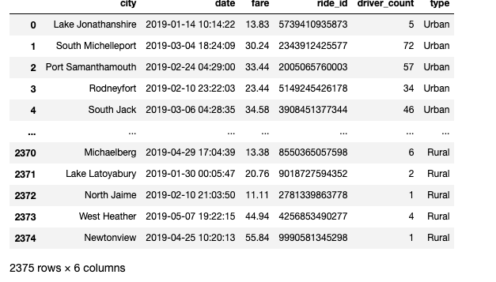
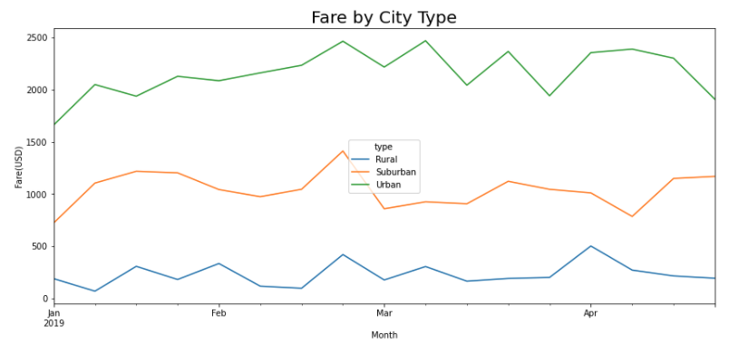

# Overview of the analysis
The purpose of the new analysis is to perform a statistical analysis, create visualizaations to tell a compelling story to PyBer, a ride share company.  They want all the information that a data scientist like myself can get, concerning how PyBer can provide ride share access and affordability for underserved communityies.  

## Results: 
My description of the differences in ride-sharing data among rural, suburban and urban cityies bigins with the data analysis of a merged data set that showed 2375 ridesharing trips.  Within this data set, the name of the city, date, cost of the fare, rider id, how many drivers the city had driving and the type of city, were counted and reviewed.

From this data set, I then built a data frame to show the total fare amount for each date and time.  The display clearly shows that there are more rides shared on one day in suburban and urban city types.

To show a specific date range, I created a data frame that shows the sum of the fares from January to April.  As one might expect, the ride sharing in the uban city, is much greater than that of the suburban and rural city types.

A graphical display of this data is shown in the line chart below.

## Summary: 

Based on the results, I have provided three business recommendations to the CEO of PyBer, to assist in addressing the disparities among the city types. 

### Recommendation 1:
Before PyBer decides to begin ridesharing in a rural city, be sure that the infrastructure can provide funding and training supports for the lower population in this city type.  If not, choose to spend resources in another demographic.

### Recommendation 2:
Suburban data shows that there is some profitability in this city type.  The use of social media to advertise your ride sharing company over Lyft or Uber should be increased by 35%.  The target audience should be 16-25 year olds.  

### Recommendation 3:  
The city type that shows the most profitability is urban.  For PyBer to succeed amongst the dother urban ride-share companies, I would suggest the same marketing strategy in recommendation 2, as well as possibly connect with another business or two to provide a 'freebie' when using PyBer.  The 'freebie' could be anything from 'ride once, get two rides at 1/2 price if used in the next seven days' to 'a massage at Massage Envy at a reduced rate'.  The key for PyBer in this market is to increase critical mass on opening day by using social media hosts and hostesses.  Success on the "Day 1 Challenge" is imperative because potential users will only put up with one or two failed rides before they choose to use Uber or Lyft.
