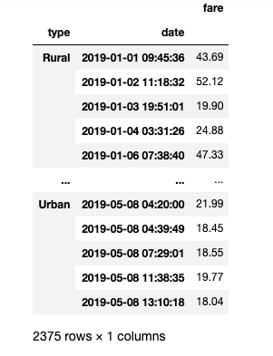
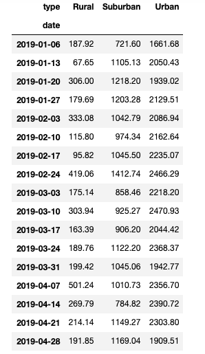

# Overview of the analysis
The purpose of the new analysis is to perform a statistical analysis, create visualizaations to tell a compelling story to PyBer, a ride share company.  They want all the information that a data scientist like myself can get, concerning how PyBer can provide ride share access and affordability for underserved communityies.  

## Results: describe the differences in ride-sharing data among the different city types.
The data analysis began with a merged data set that showed 2375 ridesharing trips, the name of the city, date, cost of the fare, rider id, how many drivers the city had driving and the type of city:  rural, suburban and urban.

From this data set, I then built a data frame to show the total fare amount for each date and time.  The display clearly shows that there are more rides shared on one day in suburban and urban city types.

To show a specific date range, I created a data frame that shows the sum of the fares from January to April.  As one might expect, the ride sharing in the uban city, is much greater than that of the suburban and rural city types.

## Summary: Based on the results, provide three business recommendations to the CEO for addressing any disparities among the city types.
